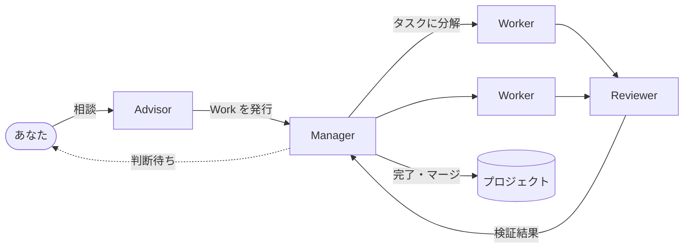

<p align="center">
  
</p>

<h1 align="center">Owl-Agent</h1>

<p align="center">
  <b>AIエージェントを「チーム」として動かす。あなたは判断するだけ。</b>
</p>

<p align="center">
  <a href="https://github.com/riry521/owl-agents/actions/workflows/ci.yml"></a>
  <a href="LICENSE"></a>
  
  
</p>

<p align="center">
  <a href="README.md">English</a> | 日本語
</p>


Owl-Agent は、役割の違う AI エージェントがチームとして仕事を進める、ローカルで動くオーケストレーションツールです。

やりたいことを Advisor に話すと、Manager が計画を立て、Worker が並行で実装し、Reviewer が検証して、完了したらプロジェクトにマージします。
あなたが呼ばれるのは、方針を決めるときや問題が起きたときの「判断待ち」だけで、その判断はスマホからでもできます。

AI の実行には、手元の **Claude Code** や **Codex** の CLI をそのまま使います。

## 特長

- **話すだけで仕事になる**：Advisor とチャットで相談すると、方針を整理してそのまま Work（仕事）として発行します。Web 画面のほか、[Slack や Discord](#slack-や-discord-から話しかける) からも話しかけられ、通知や判断待ちへの回答もそこでできます。
- **AI が役割分担して進める**：計画・設計・実装・レビューを別の AI が担当します。Worker はタスクごとに Git の worktree を分けて並行で作業します。
- **人間は判断待ちだけ見ればいい**：方針の選択が必要なときや、テストが通らなかったときだけ質問が届きます。ボードでは判断待ちが一番上に並びます。
- **外出先からスマホで使える**：Tailscale を入れて `owl serve` を1回実行するだけで、自分専用の `ts.net` の URL からスマホで Owl を開けます。ポート開放もログインも不要で、つながるのは自分の端末だけです。手順は[スマホや別の PC から使う](#スマホや別の-pc-から使うtailscale)を見てください。
- **止まっても続きから**：状態はすべて SQLite に保存します。プロセスが落ちても、レート制限で止まっても、あとから自動で再開します。
- **使うほど育つ**：仕事で見つかった手順は「スキル」として残り、Curator が改善します。知識は Obsidian 互換の Markdown に、ルールは承認制で蓄積されます。
- **ローカルで安全に**：既定では自分の PC からしかアクセスできません。エージェントのコマンドは権限フックでチェックします。この中の Outbound Guard は、`WebFetch`・`curl`・`wget`（`sh -c` の中で実行されるものを含む）の送信先だけを見る簡易な見張りです。`python` や `node` などのプログラムからの通信をふさぐ壁ではありません。

## 仕組み

「**DB が記憶し、Core が進行し、AI が思考する**」が Owl-Agent の設計の考え方です。
AI に長い会話で状態を覚えさせるのではなく、状態は DB に、次に誰が何をするかはプログラム（Core）に任せます。
AI には毎回、今のタスクに必要な情報だけを渡します。



| 役割 | やること |
|---|---|
| Advisor | あなたの相談相手。方針を整理して Work を発行する |
| Manager | Work をタスクに分けて計画し、最後に完了を判定する |
| Worker | タスクを実装する。複数の Worker が並行で動く |
| Reviewer | Worker の結果を検証する |
| Designer / Lead Designer | 設計を担当する。アーキテクチャ・データモデル・API・実装方針などを決める |
| Librarian / Curator | 仕事で得た知識やスキルを整理・改善する |

## スクリーンショット

<table>
  <tr>
    <td width="50%"><br><b>Advisor</b>：相談すると、そのまま仕事として発行します</td>
    <td width="50%"><br><b>Work の詳細</b>：タスクの進み具合とレビューの結果</td>
  </tr>
  <tr>
    <td width="50%"><br><b>判断待ち</b>：選択肢と、選ぶとどうなるかを示して質問します</td>
    <td width="50%"><br><b>スキル</b>：仕事から育った手順を Curator が改善します</td>
  </tr>
</table>

<p align="center">
  <br>
  Tailscale を使えば、外出先のスマホからも確認・判断できます
</p>

## クイックスタート

```bash
# 前提条件: macOS 14+ または Linux、Node.js ≥ 22.17.0 かつ < 23、pnpm 10.15.0
git clone https://github.com/riry521/owl-agents.git
cd owl-agents
./setup.sh

# 設定
# setup.shは、.envが存在しない場合に.env.exampleから.envを作成します。編集してください。
# セットアップ前に設定する場合は次を使用します: cp .env.example .env && chmod 600 .env
# .env.exampleのデフォルトはオフラインのstub providerです。
# 実際に動かす場合は、OWL_PROVIDER=real を設定し、インストール済みのCLIを
# OWL_PROVIDER_ADAPTER=claude-cli/v1 または codex-cli/v1 で選択してください。
# .envは自動的にロードされます。明示的なプロセス環境変数の値が優先されます。

# 新しいターミナルを開き、Owlを起動してWeb UIを開く
owl open

# ヘルスチェック
owl status
owl doctor
```

`setup.sh`は、リポジトリの`bin/`をシェルの起動ファイルで`PATH`に追加します。
これで、どのディレクトリからでも`owl`コマンドが使えます。

| シェル | ファイル |
|---|---|
| zsh | `~/.zshrc` |
| bash | `~/.bash_profile`（macOS）または`~/.bashrc`（Linux） |
| fish | `~/.config/fish/config.fish` |
| その他 | `~/.profile` |

追加されるのは末尾が`# owl-agent`の1行だけです。すでにある場合は追加しません。
`owl`を使う前に、新しいターミナルを開くか、そのファイルを`source`してください。
リポジトリを移動した場合は、`./setup.sh`をもう一度実行してください。それまでは、
リポジトリのルートで`./bin/owl`が使えます。

CLIとセットアップの表示言語は`OWL_LANG=ja`または`OWL_LANG=en`で指定できます。
未設定なら`LC_ALL`、`LC_MESSAGES`、`LANG`の順でOSロケールを参照します。

workspace packageやnative buildの要件、任意のprovider CLI、lockfileポリシーを含む
完全な依存関係一覧は[`docs/dependencies.md`](docs/dependencies.md)にあります。

## Git のpushガードと自動push

pre-pushガードは、pushするコミットに非公開語が含まれていないか確認します。
引数を省略すると、Owlのチェックアウトにガードを導入します。
別のリポジトリを保護するには、Owlのチェックアウトで次を実行し、引数に保護したいリポジトリを指定します。
`sh scripts/git-hooks/install.sh /path/to/target-repo`
`OWL_PRIVATE_WORDS_FILE`が設定されているか、`data/private-words.txt`がある場合、
`./setup.sh`もガードを導入します。導入に失敗しても警告を表示してセットアップを続けます。
この節の例では、`/path/to/owl`はOwlのチェックアウト、`/path/to/target-repo`は保護したいリポジトリを指します。
対象リポジトリの`core.hooksPath`がリポジトリ外の共有ディレクトリを指す場合は、Owlのチェックアウトで次を実行します。
`--use-hooks-path`はその共有ディレクトリに導入する指定です。インストーラは`core.hooksPath`の設定を変更せず、
`.git/hooks/pre-commit`など他のフックにも触れません。
`sh scripts/git-hooks/install.sh --use-hooks-path /path/to/target-repo`

既存の`pre-push`が導入対象のフックと内容が完全一致すれば、導入済みとして扱います。
実行権限がない場合はインストーラが付与します。異なる既存フックは上書きせず、エラーにして
手動でガードを連結する方法を表示します。連結する場合は入力を保存して両方に渡します。

```sh
input=$(mktemp) || exit 1
cat >"$input"
"/path/to/owl/scripts/git-hooks/pre-push" "$@" <"$input" || { rm -f "$input"; exit 1; }
# 既存フックでは元の入力を "$input" から読みます。
rm -f "$input"
```

語のリストは、保護するリポジトリの`data/private-words.txt`か、複数のリポジトリで
共用する場合はOwlのチェックアウトの`data/private-words.txt`に置きます。
別の場所に置く場合は`OWL_PRIVATE_WORDS_FILE`で指定します。自動pushでも使うには、
Owlサーバーのプロセス環境にこの変数を設定してください。フックは環境変数のファイル、
対象リポジトリの`data/private-words.txt`、Owlのチェックアウトの
`data/private-words.txt`の順で探します。既定の`data/`はGitの対象外です。
UTF-8のテキストで1行に1語または語句を書きます。空行と`#`で始まる行は無視します。
照合は固定文字列の部分一致で、検出した語そのものは表示しません。有効なリストが
見つからない場合は警告を出してpushを許可しますが、検査は行いません。

```text
# ローカルだけで使い、コミットしないでください。
PRIVATE_WORD_EXAMPLE
```

自動pushはProjectごとのオプトイン設定です。Projects画面でProjectを編集し、
**Work完了時に自動でpush**をオンにします。初期状態はオフです。有効にすると、Workを
マージした後にベースブランチを設定済みの上流へpushします（例: `main`が`origin/main`を
追跡）。ベースブランチに上流の設定が必要で、force pushは行いません。pushに失敗しても
Workは完了のままになり、理由が通知されます。

## Workの作成

```bash
# APIでWorkを新規作成
curl -X POST http://localhost:3787/api/v1/works \
  -H "Content-Type: application/json" \
  -d '{"request_id":"01ARZ3NDEKTSV4RRFFQ69G5FAV","idempotency_key":"01ARZ3NDEKTSV4RRFFQ69G5FAW","expected_version":0,"payload":{"title":"Build a login page","summary":"Email/password auth","size":"small","project_id":null}}'

# ステータス確認
curl http://localhost:3787/api/v1/works
```

サーバーはWorkをTaskに分解し、Workerをディスパッチし、Reviewを実行し、最終的な判定を
すべて自動的に報告します。

## Workの運用

詳細は [docs/operations.md](docs/operations.md) を参照してください。

### Workの作成と操作

- **下書きのWork**：Advisorに「下書き」「登録だけ」と伝えると、起動せずメモとしてWorkを作ります。後でWork詳細ページのStartボタンで開始します。
- **Lead Designer**：`design_mode: "lead"`（既定は`auto`）で作ったWorkは、先に設計Taskを計画し、設計が終わってから実装Taskを追加します。
- **Backlog**：`/backlog`ページにProjectごとのレビュー指摘の持ち越しが並びます。項目をWorkに紐づけたり、そこからWorkを発行したり、破棄したりできます。
- **Advisorからの操作**：AdvisorはWorkへの指示の送信（`send_work_instruction`）、タイトルや要約の編集（`update_work`）、一時停止・再開・キャンセル・削除（`pause_work`、`resume_work`、`cancel_work`、`delete_work`）ができます。
- **キャンセルと削除の違い**：キャンセルはエージェントを止めてWorkの作業ファイル（worktree）を片付け、Workはキャンセル済みとして残します。削除はWorkをDBから消し、番号を空けます。

### 動かし続ける仕組み

- **レート制限**：providerがレート制限（429など）を返すと、そのproviderを一時停止し、リセット時刻の後に自動で再開します。時刻が分からないときは15分、30分、60分と間隔を延ばして再開します。
- **Core自身の処理の表示**：Coreが統合検証、テスト、マージ前の再検証、Gitの順番待ち、ベースの取り込みを行っている間、Work詳細ページに処理の種類と経過時間が出ます。
- **マージ後のビルド**：Workがマージされると、Projectのマージ後コマンド（ビルド）を実行します。`package.json`や`pnpm-lock.yaml`など依存ファイルが変わっていれば、先にインストールコマンドを実行します。どちらかが失敗するとOwnerに通知します。どちらもProjectごとの設定です。

### メモリとルール

- **owl-memory**：エージェントは読み取り専用の`owl-memory` MCPサーバー（`index`、`page`、`search`）で知識ページを読みます。司書（Librarian）がページを整理します。
- **ルールのGit追跡**：ルールファイルは`rules/`にありますが、Gitが追跡するのは同梱の既定値（`rules/system/defaults.yaml`、`safety.yaml`、`owl-defaults.yaml`と`rules/role/advisor-defaults.yaml`）だけです。追加・承認したルールはローカルに残ります。

## Web UI

```bash
owl open
# 必要ならOwlを起動し、ブラウザで http://127.0.0.1:3787/owl/ を開きます
```

ページ: Board（work概要）、Archive、Work detail、Settings（モデル設定とプリセット）、Projects、Advisor（chat）、Backlog、Decision、Activity、Agents、Knowledge、Rules（ルール承認を含む）、Skills、Tokens。

## CLIコマンド

```bash
owl start          # サーバーを起動（バックグラウンド）
owl open           # ブラウザでWeb UIを開く（必要ならOwlを起動）
owl stop           # Owlとそのプロジェクト管理下のヘルパープロセスを停止
owl restart        # サーバーを再起動
owl status         # サーバーステータスを表示
owl doctor         # ヘルスチェックを実行 (--json, --strict)
owl cleanup        # 古いworkspaceを削除
owl serve          # Tailscale Serveで自分のtailnetに公開
owl serve --off    # Tailscale Serveでの公開をやめる
owl advisor        # 端末でAdvisorと会話（Ctrl+Dで終了。サーバーの起動が必要）

# Tailscaleを使わずにネットワークへ直接公開する場合は、bearer tokenが必須です。
OWL_BIND=0.0.0.0 OWL_API_TOKEN='use-a-long-random-value' owl start
```

## メモリ検索の埋め込み

埋め込みは任意の機能で、既定では無効です。`@huggingface/transformers`、
`sqlite-vec`、`onnxruntime-node` は任意依存です。依存がない場合や読み込みに失敗した場合
（nativeバイナリの破損を含む）も、メモリ検索は SQLite FTS5 の trigram 検索と `LIKE` で
動作します。`/api/v1/memory/health` は埋め込みが使えない理由と有効化手順を warning に
表示します。有効にしても、モデルは自動ダウンロードされません。
`--no-optional` を付けてインストールした場合は、埋め込みを有効にする前に
そのオプションを外して `pnpm install` を実行し、任意依存を追加してください。

有効にするには、`memory_embeddings.enabled` を `true` にします。
`<dataDir>/memory-embedder.json` を次のように設定します。

```json
{ "enabled": true }
```

または、サーバーの環境変数に `OWL_MEMORY_EMBEDDINGS_ENABLED=1` を設定します。
その後、既定モデルを取得してサーバーを再起動します。

```bash
node scripts/memory-models.mjs pull Xenova/multilingual-e5-small
node scripts/memory-models.mjs list
```

モデルファイルはこのリポジトリには含めていません。利用者が
`node scripts/memory-models.mjs pull <org/name>` で取得してください。依存とモデルの
ライセンス、出典は [THIRD_PARTY_NOTICES.md](THIRD_PARTY_NOTICES.md) を確認してください。

`node scripts/memory-models.mjs enable` は、埋め込みの有効化と既定モデルの準備をまとめて
行います。シェルに `OWL_DATA_DIR` が設定されていない場合は、サーバーのdataDirを指定して
実行してください。設定変更またはモデル取得の後はサーバーを再起動してください。
`/api/v1/memory/health` でembedderの状態とwarningを確認できます。

オフラインの PC では、ネットワークにつながる別の PC でモデルを取得し、モデルの
ディレクトリ全体をオフライン側の `<dataDir>/models` または `~/.owl/models` にコピーします。

```bash
# ネットワークにつながる PC で実行。--dir はモデルを取得する models ディレクトリです。
node scripts/memory-models.mjs pull Xenova/multilingual-e5-small --dir /path/to/models
# /path/to/models/Xenova/multilingual-e5-small を、オフライン側の
# <dataDir>/models/Xenova/multilingual-e5-small にコピーします。
```

コピー先は `~/.owl/models` の下でも構いません。別の models ディレクトリを使う場合は
`OWL_MEMORY_MODELS_DIR` で指定できます。オフライン側で埋め込みを有効にしてサーバーを
再起動してください。`list` でmodelsディレクトリ内のモデルを確認できます。ローカルの
embedderの実行にネットワーク接続は必要ありません。

次の表は、量子化 ONNX（`q8`）embedderが使う設定・tokenizerファイルと
`onnx/model_quantized.onnx` を取得して測定した値です。ディスク容量は `du -sh` の出力、
メモリは一時環境の `@huggingface/transformers` 4.3.0 で、リモートモデルを無効にし、
embedderと同じ ONNX オプションで短い推論を行ったときの `/usr/bin/time -l` の最大 RSS
（maximum resident set size）です。測定環境は macOS 27.0、Apple M4 Pro（arm64）、
Node.js 22.22.2 です。

| モデル | ディスク容量（`du -sh`） | 推論時の最大 RSS |
|---|---:|---:|
| `Xenova/multilingual-e5-small`（既定） | 129M | 746,536,960 bytes（約712 MiB） |
| `Xenova/multilingual-e5-base` | 282M | 1,237,352,448 bytes（約1.15 GiB） |
| `Xenova/multilingual-e5-large` | 552M | 1,965,228,032 bytes（約1.83 GiB） |

## スマホや別の PC から使う（Tailscale）

[Tailscale](https://tailscale.com/) を使うと、外出先のスマホからでも Owl を開けます。

1. Owl を動かす PC と、使いたい端末（スマホなど）の両方に Tailscale を入れて、同じアカウントでログインします。
2. PC で Owl を起動した状態で、次を1回だけ実行します。

   ```bash
   owl serve
   ```

3. 表示された `https://<マシン名>.<tailnet名>.ts.net/owl/` を、端末のブラウザで開きます。

設定は Tailscale 側に残るので、次からは `owl start` するだけで同じ URL で開けます。
`owl start` のたびに確実に公開したい場合は、`.env` に `OWL_TAILSCALE_SERVE=1` を設定します。
公開をやめるときは `owl serve --off` を実行します。

この URL は、自分の Tailscale ネットワーク（tailnet）の端末からしか開けないので、ログインやトークンは要りません。
インターネット全体に公開する Tailscale Funnel 経由のアクセスは、Owl が拒否します。
tailnet を他の人と共有している場合は、その人も Owl を操作できる点に注意してください。

## Slack や Discord から話しかける

Slack や Discord とつなぐと、ふだん使っているチャットアプリから Owl を使えます。

- **チャンネルで Advisor に話しかけられる**：Web 画面と同じように相談できます。送った画像やファイルは Advisor の共有フォルダに入るので、「さっき送ったスクショを見て」がそのまま通じます。
- **通知が届く**：タスクの完了・失敗や、判断待ちが発生したときに知らせます。
- **ボタンで判断できる**：判断待ちの通知についているボタンを押すだけで答えられます。

連携ごとに、会話用のチャンネル（あなたのメッセージと Advisor の返信）と、通知用のチャンネルを決めます。同じチャンネルにしてもかまいません。DM や他のチャンネルのメッセージは無視します。
どちらの連携も任意で、設定を保存するとすぐにつながります。Owl の再起動は要りません。

### Slack

1. [api.slack.com/apps](https://api.slack.com/apps) で **Create New App → From a manifest** を選び、[`docs/slack-manifest.yaml`](docs/slack-manifest.yaml) の中身を貼り付けます。Owl の設定画面にもコピー用のボタンがあります。
2. アプリをワークスペースにインストールし、**Bot Token**（`xoxb-...`）をコピーします。
3. **Basic Information → App-Level Tokens** で、`connections:write` のスコープを付けたトークンを作ってコピーします（`xapp-...`）。
4. 使うチャンネルに Bot を招待し（`/invite @owl-agent`）、チャンネル詳細の一番下にあるチャンネル ID をコピーします。
5. Owl の **設定 → 連携 → Slack** に、トークンとチャンネル ID を入れて保存します。

### Discord

1. [Discord Developer Portal](https://discord.com/developers/applications) でアプリケーションを作り、**Bot** のページでトークンをコピーします。同じページで **Message Content Intent** をオンにします。
2. **OAuth2 → URL Generator** で、スコープに `bot`、権限に **Send Messages**・**Read Message History**・**Embed Links** を選びます。できた URL を開いて、Bot を自分のサーバーに追加します。
3. Discord の開発者モードをオンにし（**ユーザー設定 → 詳細設定**）、チャンネルを右クリックして **チャンネル ID をコピー** を選びます。
4. Owl の **設定 → 連携 → Discord** に、トークンとチャンネル ID を入れて保存します。

`owl setup` や `.env` の変数（`.env.example` を参照）でも設定できます。トークンは権限 `600` の `.env` に保存されます。

## コネクタを別プロセスで動かす（上級者向け）

設定済みのコネクタは Owl のサーバーの中で自動的に動くので、ふつうはこの節の設定は要りません。
既存の`SLACK_CHANNEL_ID` / `DISCORD_CHANNEL_ID`設定は、引き続き会話用と通知用の両方に使われます。
Slack/Discordを別プロセスとして動かしたい場合は、単体の`apps/connectors`コマンドも
利用できます。これは同じ完全なconnector実装を再利用しており、設定済みの通知チャンネル、
Advisorの返信、対話的なDecisionボタンを含みます。Owlサーバーが起動している必要があり、
`OWL_API_BASE`/`OWL_WS_URL`がそれを指している必要があります。単一providerのプロセスでは、
`OWL_CONNECTOR_ACCOUNT_ID`が引き続きサポートされます。provider固有の
`OWL_SLACK_CONNECTOR_ACCOUNT_ID`と`OWL_DISCORD_CONNECTOR_ACCOUNT_ID`はそれより優先されます。
`--all`にはprovider固有の変数が両方必要で、共有変数のみでは拒否されます。

```bash
# 環境変数を設定（.env.example参照）してから:
node apps/connectors/dist/cli.js --slack
node apps/connectors/dist/cli.js --discord

# --allには、2つのprovider所有のConnector Account IDを使用します:
OWL_SLACK_CONNECTOR_ACCOUNT_ID=01... \
OWL_DISCORD_CONNECTOR_ACCOUNT_ID=01... \
node apps/connectors/dist/cli.js --all
```

`owl stop`は、サーバーを停止する前に、このチェックアウトから起動された単体の
connectorやsupervisorプロセスも停止します。別のOwlチェックアウトのプロセスは
別インスタンスとして扱われます。

## 外部プラグイン

Owlは外部プラグインを子プロセスとして起動できます。`OWL_PLUGINS_FILE`に
JSONファイルの絶対パスを指定します。未設定の場合、外部プラグインは読み込まれません。

### 設定

ファイルにはトップレベルの`plugins`配列を置きます。たとえば、
`plugins.json`がリポジトリのルートにある場合、次の設定でサンプルを起動できます。

```json
{
  "plugins": [
    {
      "name": "log-notify",
      "command": "node",
      "args": ["dist/index.js"],
      "cwd": "examples/plugins/log-notify",
      "enabled": true,
      "env": {}
    }
  ]
}
```

トップレベルまたはプラグイン項目に未知のキーがあるとエラーになります。
検証に失敗すると、そのファイルのプラグインは1つも起動しません。各項目のルールは次のとおりです。

- `name`は`^[a-z0-9][a-z0-9-]{0,39}$`に一致し、重複しないこと。
- `command`は空でない文字列であること。
- `args`は文字列の配列。省略時は`[]`です。
- `cwd`は存在するディレクトリであること。絶対パス、または
  `OWL_PLUGINS_FILE`があるディレクトリからの相対パスを指定できます。
- `enabled`はboolean。省略時は`true`です。
- `env`の値は文字列であること。キーは`^[A-Z_][A-Z0-9_]*$`に一致し、
  `OWL_`で始まるキーは予約済みのため指定できません。

設定ファイルが見つからない場合や無効な場合、サーバーは
`[owl-server] plugins: ...`をログに出し、プラグインなしで起動を続けます。

### 子プロセスの環境変数

プラグインプロセスに渡される環境変数は次のものだけです。

- サーバープロセスからコピーした`PATH`、`HOME`、`LANG`（存在する場合）。
- そのプラグイン項目の`env`に指定した値。
- Owlが設定する予約変数：`OWL_API_BASE=http://127.0.0.1:<port>/api/v1`、
  設定されている場合の`OWL_API_TOKEN`、項目のnameを表す`OWL_PLUGIN_NAME`、
  起動前に作られる`OWL_PLUGIN_STATE_DIR=<dataDir>/plugins/<name>`。

サーバーの`process.env`にあるその他の変数は引き継ぎません。
プラグイン固有の秘密は、プラグインプロセス自身が自分の`cwd`にある
`.env`から読み込んでください。

### 起動・再起動・停止

サーバーのlisten後、`connectorManager.startAll()`の直後にプラグインを起動します。
プラグインのstdoutとstderrは1行ずつ`[plugin:<name>]`を付けてサーバーログに流します。

予期しない終了後は、1秒・2秒・4秒・8秒・16秒後に、最大5回まで再起動します。
10分間安定して動いた場合は再起動回数を数え直します。上限に達すると
エラーログを出して再起動をやめます。サーバー停止時はコネクタと同じタイミングで
プラグインを停止し、SIGTERMを送ります。既定の5秒以内に停止しなければSIGKILLを送り、
停止中は再起動しません。

### plugin-sdkの利用

`runPluginFromEnv`は環境変数から`PluginConfig`を作り、プラグインを起動します。

```ts
export async function runPluginFromEnv(factory: (config: PluginConfig) => OwlPlugin, env?: NodeJS.ProcessEnv): Promise<OwlPlugin>;
```

`OWL_API_BASE`は必須で、`core_api_base`になります。ない場合は分かりやすいエラーを出して
終了コード1で終了します。`OWL_API_TOKEN`は任意の`api_token`、
`OWL_WS_URL`は任意の`core_ws_url`になります。`OWL_PLUGIN_NAME`が`plugin_name`になります。
`OWL_PLUGIN_STATE_DIR`が設定されていれば、
`<OWL_PLUGIN_STATE_DIR>/state.json`を使う`FileConnectorStateStore`を設定します。
`start()`の後にSIGTERMまたはSIGINTを受けると、`stop()`を呼んで終了コード0で終了します。

```ts
import {
  BasePlugin,
  runPluginFromEnv,
  type OwlEvent,
  type PluginConfig,
} from '@owl/plugin-sdk';

class LogPlugin extends BasePlugin {
  readonly name: string;

  constructor(config: PluginConfig) {
    super(config);
    this.name = config.plugin_name;
  }

  async onEvent(event: OwlEvent): Promise<void> {
    console.log(JSON.stringify(event));
  }
}

void runPluginFromEnv((config) => new LogPlugin(config));
```

### 別リポジトリからSDKを使う

`owl-agents`と同じ親ディレクトリにある`my-private-plugins`から使う場合は、
まずowl-agents側でSDKをビルドします。

```sh
# owl-agents内で実行
pnpm --filter @owl/plugin-sdk build
```

次にプラグインリポジトリの`package.json`からローカルSDKを参照します
（パスはそのpackageのディレクトリからの相対パスです）。

```json
{
  "dependencies": {
    "@owl/plugin-sdk": "file:../owl-agents/packages/plugin-sdk"
  }
}
```

プラグインをビルドする前に、そのリポジトリで`npm install`を実行します。

### log-notifyサンプルのビルドと起動

サンプルはpnpmワークスペース外にあるため、ルートの`pnpm install`や
`pnpm build`には含まれません。`owl-agents`リポジトリのルートでSDKをビルドし、
サンプルのディレクトリ内で依存関係のインストールとビルドを行います。

```sh
pnpm --filter @owl/plugin-sdk build
cd examples/plugins/log-notify
npm install
npm run build
```

生成された`dist/index.js`は、設定ファイルがリポジトリのルートにある場合、
`command: "node"`、`args: ["dist/index.js"]`、`cwd: "examples/plugins/log-notify"`
として登録します。`OWL_PLUGINS_FILE`にそのファイルの絶対パスを指定してOwlを起動すると、
サーバーがプラグインを起動し、受信したイベントを1行ずつJSONでstdoutに出力します。

## Supervisor（任意）

クラッシュ時にサーバーを再起動するプロセスモニターです。

```bash
node apps/supervisor/dist/supervisor.js
```

## Workspace構成

| パス | パッケージ | 用途 |
|------|---------|---------|
| `packages/shared` | `@owl/shared` | 共有の型とcontract |
| `packages/db` | `@owl/db` | SQLiteデータベース層 |
| `packages/core` | `@owl/core` | ワークフローエンジンと状態管理 |
| `packages/agent-runtime` | `@owl/agent-runtime` | AIロールのprompt builderとresponse parser |
| `packages/providers` | `@owl/providers` | Provider adapter（stub、claude-cli、codex-cli） |
| `packages/connector-slack` | `@owl/connector-slack` | Slackコネクタ |
| `packages/connector-discord` | `@owl/connector-discord` | Discordコネクタ |
| `packages/plugin-sdk` | `@owl/plugin-sdk` | 外部プラグイン用SDK |
| `apps/server` | `@owl/server` | HTTP/WSサーバーとCLI |
| `apps/web` | `web` | Next.jsダッシュボード |
| `apps/supervisor` | `@owl-agent/supervisor` | プロセスモニター |
| `apps/connectors` | `@owl-agent/connectors` | SlackとDiscordのブリッジ |

## Providerモード

- **stub**: 開発/テスト用の固定レスポンス（AI呼び出しやprovider CLIは不要）
- **real**: 実際のAI実行のために選択された`claude`または`codex`のCLIサブプロセスを起動

決定論的なオフライン利用には`OWL_PROVIDER=stub`を設定します。real modeの場合は、
選択した`OWL_PROVIDER_ADAPTER`、モデル、実行ファイルを設定してください。Owlは起動時に
選択されたadapterのみをチェックします。provider CLIは外部依存であり、自動的には
インストールされません。両方の実行ファイルが利用可能な場合、既存のロールごとの
Claude/Codex設定は引き続きサポートされます。

## サポート対象システムとデータ

v1では、macOS 14+とLinuxがサポートされています。Windowsは未サポート/実験的であり、
ここではWindows固有のプロセス、native依存、サービス統合は一切保証していません。

`OWL_DATA_DIR`は、SQLite、ログ、PID/stateファイル、アップロード、connectorの
メタデータ、settingsのための共通の永続データルートです。デフォルトは`OWL_ROOT`配下の
`./data`です。Connector Tokenは、カスタムのProvider API keyとともに、mode 600の
プロジェクト`.env`に保管されます。旧`.owl-data`ファイルは、正本のファイルが存在しない
場合にのみコピーされます。旧ディレクトリは削除も上書きもされません。既存の暗号化された
connector Vaultは、`OWL_SECRET_PASSPHRASE`が明示的に指定された場合に限り、一度だけの
マイグレーション用として受け付けられます。通常の起動でそれを尋ねられることはありません。

Owlが停止している間に、完全な`OWL_DATA_DIR`（`owl.sqlite`、settings、アップロードを
含む）と、connectorアクセスの復元が必要な場合はプロジェクトの`.env`をバックアップして
ください。secretsや`.env`はソースコード管理にコピーしないでください。

既知のv1の制限: Typesafe API keyのsettings UIはマスクされた値を返し、keyはmode 0600の
settingsファイルに保存されます。Connector Tokenとカスタムのprovider API keyはmode 0600の
`.env`に保管されます。プロジェクトディレクトリへのアクセスを制限し、専用アカウントを
使用してください。

## ライセンス

[MIT](LICENSE)
