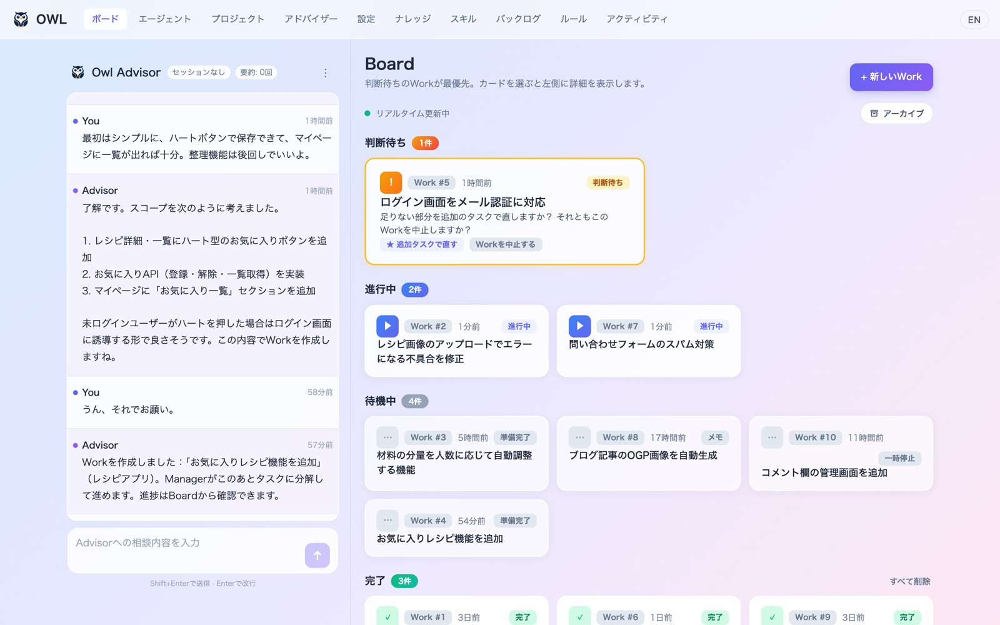
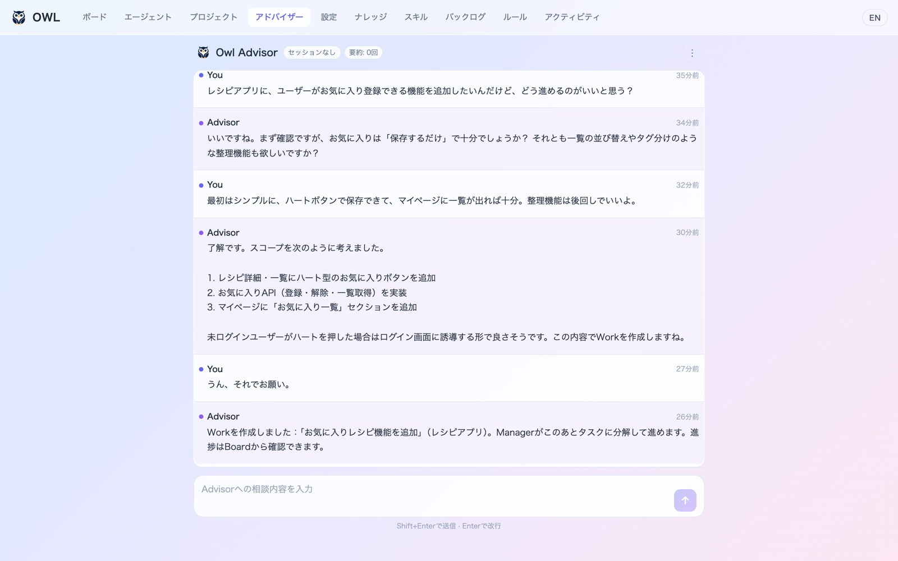
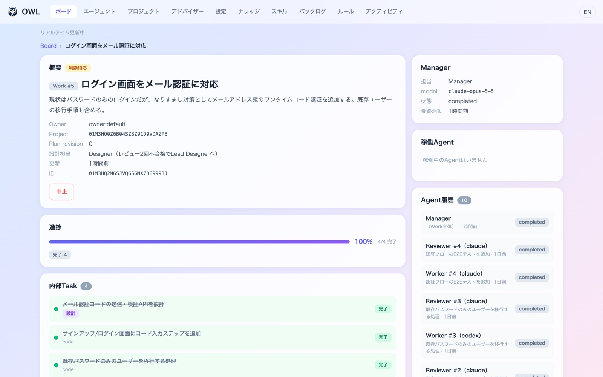
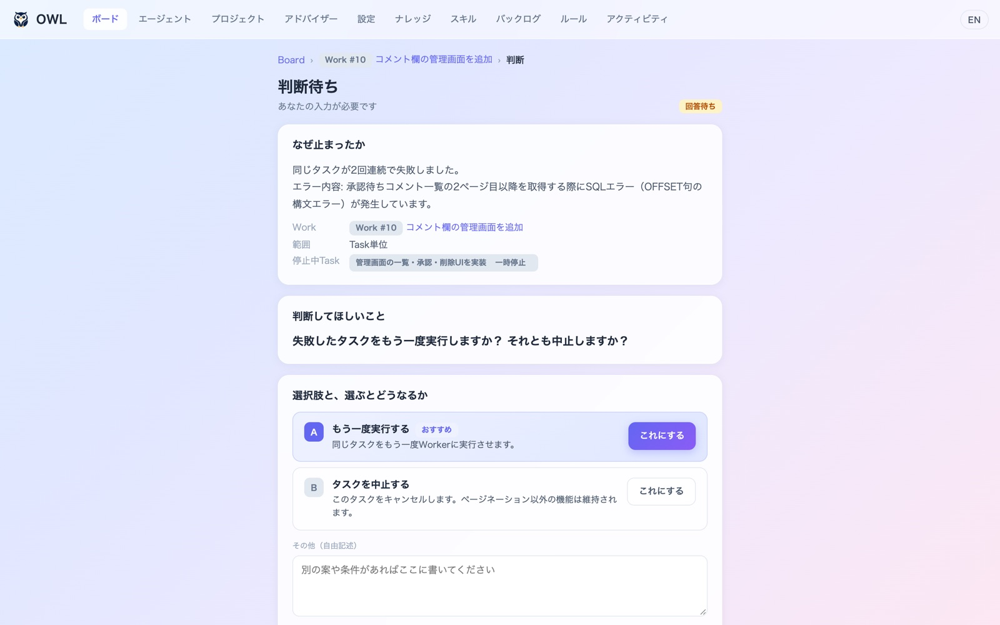
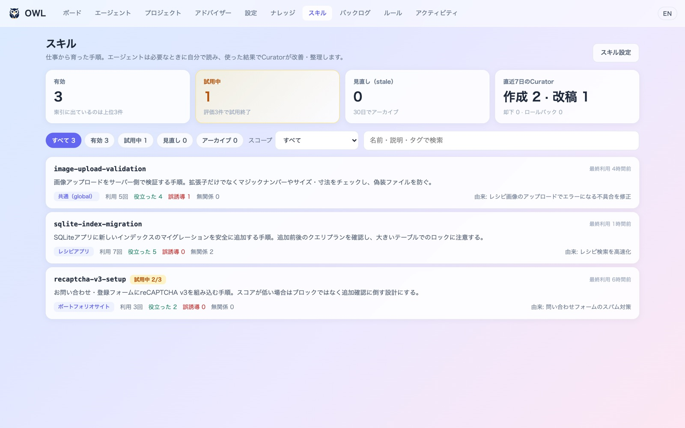
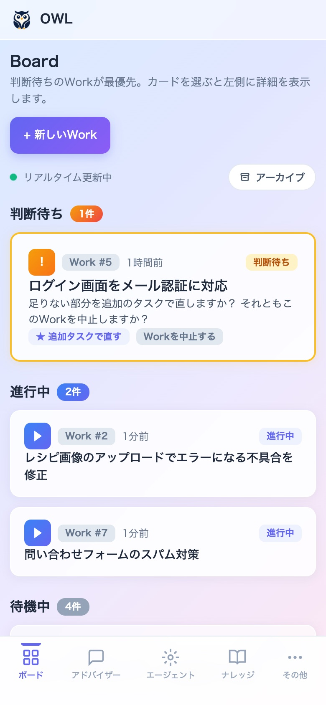

<p align="center">
  
</p>

<h1 align="center">Owl-Agent</h1>

<p align="center">
  <b>AIエージェントを「チーム」として動かす。あなたは判断するだけ。</b>
</p>

<p align="center">
  <a href="https://github.com/riry521/owl-agents/actions/workflows/ci.yml"></a>
  <a href="LICENSE"></a>
  
  
</p>

<p align="center">
  <a href="README.md">English</a> | 日本語
</p>



Owl-Agent は、役割の違う AI エージェントがチームとして仕事を進める、ローカルで動くオーケストレーションツールです。

やりたいことを Advisor に話すと、Manager が計画を立て、Worker が並行で実装し、Reviewer が検証して、完了したらプロジェクトにマージします。
あなたが呼ばれるのは、方針を決めるときや問題が起きたときの「判断待ち」だけです。

AI の実行には、手元の **Claude Code** や **Codex** の CLI をそのまま使います。

## 特長

- **話すだけで仕事になる**：Advisor とチャットで相談すると、方針を整理してそのまま Work（仕事）として発行します。Web 画面のほか、Slack や Discord からも話しかけられます。
- **AI が役割分担して進める**：計画・実装・レビュー・デザインを別の AI が担当します。Worker はタスクごとに Git の worktree を分けて並行で作業します。
- **人間は判断待ちだけ見ればいい**：方針の選択が必要なときや、テストが通らなかったときだけ質問が届きます。ボードでは判断待ちが一番上に並びます。
- **止まっても続きから**：状態はすべて SQLite に保存します。プロセスが落ちても、レート制限で止まっても、あとから自動で再開します。
- **使うほど育つ**：仕事で見つかった手順は「スキル」として残り、Curator が改善します。知識は Obsidian 互換の Markdown に、ルールは承認制で蓄積されます。
- **ローカルで安全に**：既定では自分の PC からしかアクセスできません。エージェントのコマンドは権限フックでチェックします。

## 仕組み

「**DB が記憶し、Core が進行し、AI が思考する**」が Owl-Agent の設計の考え方です。
AI に長い会話で状態を覚えさせるのではなく、状態は DB に、次に誰が何をするかはプログラム（Core）に任せます。
AI には毎回、今のタスクに必要な情報だけを渡します。


| 役割 | やること |
|---|---|
| Advisor | あなたの相談相手。方針を整理して Work を発行する |
| Manager | Work をタスクに分けて計画し、最後に完了を判定する |
| Worker | タスクを実装する。複数の Worker が並行で動く |
| Reviewer | Worker の結果を検証する |
| Designer / Lead Designer | 見た目や UX を担当する |
| Librarian / Curator | 仕事で得た知識やスキルを整理・改善する |

## スクリーンショット

<table>
  <tr>
    <td width="50%"><br><b>Advisor</b>：相談すると、そのまま仕事として発行します</td>
    <td width="50%"><br><b>Work の詳細</b>：タスクの進み具合とレビューの結果</td>
  </tr>
  <tr>
    <td width="50%"><br><b>判断待ち</b>：選択肢と、選ぶとどうなるかを示して質問します</td>
    <td width="50%"><br><b>スキル</b>：仕事から育った手順を Curator が改善します</td>
  </tr>
</table>

<p align="center">
  <br>
  スマホからも確認・判断できます
</p>

## クイックスタート

```bash
# 前提条件: macOS 14+ または Linux、Node.js ≥ 22.17.0 かつ < 23、pnpm 10.15.0
git clone https://github.com/riry521/owl-agents.git
cd owl-agents
./setup.sh

# 設定
# setup.shは、.envが存在しない場合に.env.exampleから.envを作成します。編集してください。
# セットアップ前に設定する場合は次を使用します: cp .env.example .env && chmod 600 .env
# .env.exampleのデフォルトはオフラインのstub providerです。
# 実際に動かす場合は、OWL_PROVIDER=real を設定し、インストール済みのCLIを
# OWL_PROVIDER_ADAPTER=claude-cli/v1 または codex-cli/v1 で選択してください。
# .envは自動的にロードされます。明示的なプロセス環境変数の値が優先されます。

# 新しいターミナルを開き、Owlを起動してWeb UIを開く
owl open

# ヘルスチェック
owl status
owl doctor
```

`setup.sh`は、リポジトリの`bin/`をシェルの起動ファイルで`PATH`に追加します。
これで、どのディレクトリからでも`owl`コマンドが使えます。

| シェル | ファイル |
|---|---|
| zsh | `~/.zshrc` |
| bash | `~/.bash_profile`（macOS）または`~/.bashrc`（Linux） |
| fish | `~/.config/fish/config.fish` |
| その他 | `~/.profile` |

追加されるのは末尾が`# owl-agent`の1行だけです。すでにある場合は追加しません。
`owl`を使う前に、新しいターミナルを開くか、そのファイルを`source`してください。
リポジトリを移動した場合は、`./setup.sh`をもう一度実行してください。それまでは、
リポジトリのルートで`./bin/owl`が使えます。

CLIとセットアップの表示言語は`OWL_LANG=ja`または`OWL_LANG=en`で指定できます。
未設定なら`LC_ALL`、`LC_MESSAGES`、`LANG`の順でOSロケールを参照します。

workspace packageやnative buildの要件、任意のprovider CLI、lockfileポリシーを含む
完全な依存関係一覧は[`docs/dependencies.md`](docs/dependencies.md)にあります。

## Workの作成

```bash
# APIでWorkを新規作成
curl -X POST http://localhost:3787/api/v1/works \
  -H "Content-Type: application/json" \
  -d '{"request_id":"01ARZ3NDEKTSV4RRFFQ69G5FAV","idempotency_key":"01ARZ3NDEKTSV4RRFFQ69G5FAW","expected_version":0,"payload":{"title":"Build a login page","summary":"Email/password auth","size":"small","project_id":null}}'

# ステータス確認
curl http://localhost:3787/api/v1/works
```

サーバーはWorkをTaskに分解し、Workerをディスパッチし、Reviewを実行し、最終的な判定を
すべて自動的に報告します。

## Web UI

```bash
owl open
# 必要ならOwlを起動し、ブラウザで http://127.0.0.1:3787/owl/ を開きます
```

ページ: Board（work概要）、Archive、Work detail、Settings（モデル設定とプリセット）、Projects、Advisor（chat）。

## CLIコマンド

```bash
owl start          # サーバーを起動（バックグラウンド）
owl open           # ブラウザでWeb UIを開く（必要ならOwlを起動）
owl stop           # Owlとそのプロジェクト管理下のヘルパープロセスを停止
owl restart        # サーバーを再起動
owl status         # サーバーステータスを表示
owl doctor         # ヘルスチェックを実行 (--json, --strict)
owl cleanup        # 古いworkspaceを削除
owl serve           # Tailscale Serveを明示的に有効化
owl serve --off    # Tailscale Serveを明示的に無効化

# 公開/リモートアクセスはopt-inであり、bearer tokenが必須です。
OWL_BIND=0.0.0.0 OWL_API_TOKEN='use-a-long-random-value' owl start
# または、owl start の前に .env に OWL_TAILSCALE_SERVE=1 と OWL_API_TOKEN を設定します。
```

## Connectors（任意）

サーバーは、設定済みのSlack/Discord packageコネクタを自動的に起動します。
Slack/Discordは任意であり、両方とも未設定のままにしておくのは通常の状態で、
起動時やdoctorの警告にはなりません。`owl setup`、Settings画面、または`.env`の
任意の変数からこれらを設定します。各connectorには会話チャンネル（受信メッセージと
Advisorの返信用）とタスク通知チャンネル（task/decision/systemの通知用）があります。
両者は同じチャンネルでもかまいません。ダイレクトメッセージや他のチャンネルは無視
されます。既存の`SLACK_CHANNEL_ID` / `DISCORD_CHANNEL_ID`設定は、引き続き両方の役割に
使用されます。
Slack/Discordを別プロセスとして動かしたい場合は、単体の`apps/connectors`コマンドも
利用できます。これは同じ完全なconnector実装を再利用しており、設定済みの通知チャンネル、
Advisorの返信、対話的なDecisionボタンを含みます。Owlサーバーが起動している必要があり、
`OWL_API_BASE`/`OWL_WS_URL`がそれを指している必要があります。単一providerのプロセスでは、
`OWL_CONNECTOR_ACCOUNT_ID`が引き続きサポートされます。provider固有の
`OWL_SLACK_CONNECTOR_ACCOUNT_ID`と`OWL_DISCORD_CONNECTOR_ACCOUNT_ID`はそれより優先されます。
`--all`にはprovider固有の変数が両方必要で、共有変数のみでは拒否されます。

```bash
# 環境変数を設定（.env.example参照）してから:
node apps/connectors/dist/cli.js --slack
node apps/connectors/dist/cli.js --discord

# --allには、2つのprovider所有のConnector Account IDを使用します:
OWL_SLACK_CONNECTOR_ACCOUNT_ID=01... \
OWL_DISCORD_CONNECTOR_ACCOUNT_ID=01... \
node apps/connectors/dist/cli.js --all
```

`owl stop`は、サーバーを停止する前に、このチェックアウトから起動された単体の
connectorやsupervisorプロセスも停止します。別のOwlチェックアウトのプロセスは
別インスタンスとして扱われます。

## Supervisor（任意）

クラッシュ時にサーバーを再起動するプロセスモニターです。

```bash
node apps/supervisor/dist/supervisor.js
```

## Workspace構成

| パス | パッケージ | 用途 |
|------|---------|---------|
| `packages/shared` | `@owl/shared` | 共有の型とcontract |
| `packages/db` | `@owl/db` | SQLiteデータベース層 |
| `packages/core` | `@owl/core` | ワークフローエンジンと状態管理 |
| `packages/agent-runtime` | `@owl/agent-runtime` | AIロールのprompt builderとresponse parser |
| `packages/providers` | `@owl/providers` | Provider adapter（stub、claude-cli） |
| `apps/server` | `@owl/server` | HTTP/WSサーバーとCLI |
| `apps/web` | `web` | Next.jsダッシュボード |
| `apps/supervisor` | `@owl/supervisor` | プロセスモニター |
| `apps/connectors` | `@owl/connectors` | SlackとDiscordのブリッジ |

## Providerモード

- **stub**: 開発/テスト用の固定レスポンス（AI呼び出しやprovider CLIは不要）
- **real**: 実際のAI実行のために選択された`claude`または`codex`のCLIサブプロセスを起動

決定論的なオフライン利用には`OWL_PROVIDER=stub`を設定します。real modeの場合は、
選択した`OWL_PROVIDER_ADAPTER`、モデル、実行ファイルを設定してください。Owlは起動時に
選択されたadapterのみをチェックします。provider CLIは外部依存であり、自動的には
インストールされません。両方の実行ファイルが利用可能な場合、既存のロールごとの
Claude/Codex設定は引き続きサポートされます。

## サポート対象システムとデータ

v1では、macOS 14+とLinuxがサポートされています。Windowsは未サポート/実験的であり、
ここではWindows固有のプロセス、native依存、サービス統合は一切保証していません。

`OWL_DATA_DIR`は、SQLite、ログ、PID/stateファイル、アップロード、connectorの
メタデータ、settingsのための共通の永続データルートです。デフォルトは`OWL_ROOT`配下の
`./data`です。Connector Tokenは、カスタムのProvider API keyとともに、mode 600の
プロジェクト`.env`に保管されます。旧`.owl-data`ファイルは、正本のファイルが存在しない
場合にのみコピーされます。旧ディレクトリは削除も上書きもされません。既存の暗号化された
connector Vaultは、`OWL_SECRET_PASSPHRASE`が明示的に指定された場合に限り、一度だけの
マイグレーション用として受け付けられます。通常の起動でそれを尋ねられることはありません。

Owlが停止している間に、完全な`OWL_DATA_DIR`（`owl.sqlite`、settings、アップロードを
含む）と、connectorアクセスの復元が必要な場合はプロジェクトの`.env`をバックアップして
ください。secretsや`.env`はソースコード管理にコピーしないでください。

既知のv1の制限: Typesafe API keyのsettings UIはマスクされた値を返し、keyはmode 0600の
settingsファイルに保存されます。Connector Tokenとカスタムのprovider API keyはmode 0600の
`.env`に保管されます。プロジェクトディレクトリへのアクセスを制限し、専用アカウントを
使用してください。

## ライセンス

[MIT](LICENSE)
