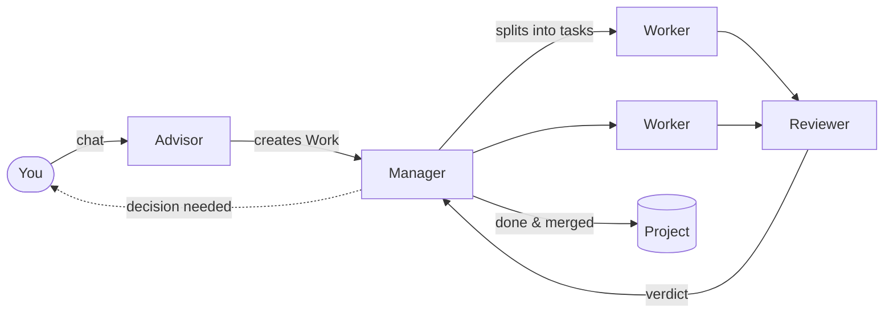

<p align="center">
  
</p>

<h1 align="center">Owl-Agent</h1>

<p align="center">
  <b>Run AI agents as a team. You only make the calls.</b>
</p>

<p align="center">
  <a href="https://github.com/riry521/owl-agents/actions/workflows/ci.yml"></a>
  <a href="LICENSE"></a>
  
  
</p>

<p align="center">
  English | <a href="README.ja.md">日本語</a>
</p>


Owl-Agent is a local orchestration tool where AI agents with different roles work together as a team.

Tell the Advisor what you want. The Manager plans the work, Workers build it in parallel, a Reviewer checks the results, and the finished work is merged into your project.
You are only asked when a decision is needed, such as choosing a direction or handling a failure.

Agents run through the **Claude Code** or **Codex** CLI you already have installed.

## Features

- **Just talk to it.** Discuss an idea with the Advisor in chat, and it turns the plan into a Work. You can also reach the Advisor from Slack or Discord.
- **A team of roles.** Separate agents plan, build, review, and design. Each Worker gets its own Git worktree, so tasks run in parallel without stepping on each other.
- **You only handle decisions.** You get a question only when a choice is needed or a check fails. Decisions always sit at the top of the board.
- **Picks up where it left off.** All state lives in SQLite. If a process crashes or a provider hits its rate limit, the work resumes automatically.
- **Gets better with use.** Procedures found during work become skills that the Curator keeps improving. Knowledge is stored as Obsidian-compatible Markdown, and project rules are added only after you approve them.
- **Local and safe by default.** Only your own machine can reach Owl unless you opt in. Agent commands go through a permission hook.

## How it works

Owl-Agent follows one idea: **the DB remembers, the Core advances, the AI thinks.**
Instead of asking an AI to remember everything in a long conversation, state lives in the database and a program (the Core) decides who does what next.
Each agent gets only the information it needs for its current task.



| Role | What it does |
|---|---|
| Advisor | Your counterpart. Shapes the plan and creates Works |
| Manager | Splits a Work into tasks, coordinates them, and makes the final call |
| Worker | Implements tasks. Several Workers run in parallel |
| Reviewer | Verifies each Worker's result |
| Designer / Lead Designer | Handles visuals and UX |
| Librarian / Curator | Organizes and improves knowledge and skills learned from work |

## Screenshots

<table>
  <tr>
    <td width="50%"><br><b>Advisor</b>: talk through an idea and it becomes a Work</td>
    <td width="50%"><br><b>Work detail</b>: task progress and review results</td>
  </tr>
  <tr>
    <td width="50%"><br><b>Decisions</b>: each option explains what happens if you pick it</td>
    <td width="50%"><br><b>Skills</b>: procedures grown from real work, improved by the Curator</td>
  </tr>
</table>

<p align="center">
  <br>
  Check progress and make decisions from your phone
</p>

## Quick Start

```bash
# Prerequisites: macOS 14+ or Linux, Node.js ≥ 22.17.0 and < 23, pnpm 10.15.0
git clone https://github.com/riry521/owl-agents.git
cd owl-agents
./setup.sh

# Configure
# setup.sh creates .env from .env.example when it is absent; edit that file.
# If you are configuring before setup, use: cp .env.example .env && chmod 600 .env
# The example defaults to the offline stub provider.
# For a real run, set OWL_PROVIDER=real and select an installed CLI with
# OWL_PROVIDER_ADAPTER=claude-cli/v1 or codex-cli/v1.
# .env is loaded automatically; explicit process environment values win.

# Open a new terminal, then start Owl and open the Web UI
owl open

# Check health
owl status
owl doctor
```

`setup.sh` adds the repo's `bin/` directory to `PATH` in your shell startup file,
so the `owl` command works from any directory:

| Shell | File |
|---|---|
| zsh | `~/.zshrc` |
| bash | `~/.bash_profile` (macOS) or `~/.bashrc` (Linux) |
| fish | `~/.config/fish/config.fish` |
| other | `~/.profile` |

It adds one line ending in `# owl-agent` and skips this step when the line is
already there. Open a new terminal (or `source` that file) before using `owl`.
If you move the repo, run `./setup.sh` again. Until then, `./bin/owl` works
from the repo root.

Set `OWL_LANG=ja` or `OWL_LANG=en` for CLI and setup messages. If unset,
`LC_ALL`, then `LC_MESSAGES`, then `LANG` determines the language.

The complete dependency inventory, including workspace packages, native build
requirements, optional provider CLIs, and the lockfile policy, is in
[`docs/dependencies.md`](docs/dependencies.md).

## Creating Work

```bash
# Create a new Work item via API
curl -X POST http://localhost:3787/api/v1/works \
  -H "Content-Type: application/json" \
  -d '{"request_id":"01ARZ3NDEKTSV4RRFFQ69G5FAV","idempotency_key":"01ARZ3NDEKTSV4RRFFQ69G5FAW","expected_version":0,"payload":{"title":"Build a login page","summary":"Email/password auth","size":"small","project_id":null}}'

# Check status
curl http://localhost:3787/api/v1/works
```

The server decomposes the Work into Tasks, dispatches Workers, runs Reviews, and reports the final verdict — all automatically.

## Web UI

```bash
owl open
# Starts Owl if needed and opens http://127.0.0.1:3787/owl/ in your browser
```

Pages: Board (work overview), Archive, Work detail, Settings (model config and presets), Projects, Advisor (chat).

## CLI Commands

```bash
owl start          # Start server (background)
owl open           # Open the Web UI in your browser (starts Owl if needed)
owl stop           # Stop Owl and its project-managed helper processes
owl restart        # Restart server
owl status         # Show server status
owl doctor         # Run health checks (--json, --strict)
owl cleanup        # Remove stale workspaces
owl serve           # Explicitly enable Tailscale Serve
owl serve --off    # Explicitly disable Tailscale Serve

# Public/remote access is opt-in and requires a bearer token.
OWL_BIND=0.0.0.0 OWL_API_TOKEN='use-a-long-random-value' owl start
# Or set OWL_TAILSCALE_SERVE=1 plus OWL_API_TOKEN in .env before owl start.
```

## Connectors (optional)

The server automatically starts configured Slack/Discord package connectors.
Slack/Discord are optional; leaving both unconfigured is a normal state and does
not produce a startup or doctor warning. Configure them through `owl setup`, the
Settings screen, or the optional variables in `.env`. Each connector has a
conversation channel (for inbound messages and Advisor replies) and a task
notification channel (for task/decision/system notifications). They may be the
same channel. Direct messages and other channels are ignored. Existing
`SLACK_CHANNEL_ID` / `DISCORD_CHANNEL_ID` settings continue to be used for both
roles.
The standalone `apps/connectors` command is also available when Slack or
Discord should run as a separate process. It reuses the same full connector
implementation as the server-managed path, including the configured
notification channel, Advisor replies, and interactive Decision buttons. The
Owl server must be running and `OWL_API_BASE`/`OWL_WS_URL` should point to it.
For a single-provider process, `OWL_CONNECTOR_ACCOUNT_ID` remains supported;
the provider-specific `OWL_SLACK_CONNECTOR_ACCOUNT_ID` and
`OWL_DISCORD_CONNECTOR_ACCOUNT_ID` variables take precedence. `--all` requires
both provider-specific variables; a shared variable alone is rejected.

```bash
# Set env vars (see .env.example), then:
node apps/connectors/dist/cli.js --slack
node apps/connectors/dist/cli.js --discord

# For --all, use two provider-owned Connector Account IDs:
OWL_SLACK_CONNECTOR_ACCOUNT_ID=01... \
OWL_DISCORD_CONNECTOR_ACCOUNT_ID=01... \
node apps/connectors/dist/cli.js --all
```

`owl stop` also stops standalone connector or supervisor processes launched
from this checkout before stopping the server. Processes from another Owl
checkout are treated as a separate instance.

## Supervisor (optional)

Process monitor that restarts the server on crash.

```bash
node apps/supervisor/dist/supervisor.js
```

## Workspace Layout

| Path | Package | Purpose |
|------|---------|---------|
| `packages/shared` | `@owl/shared` | Shared types & contracts |
| `packages/db` | `@owl/db` | SQLite database layer |
| `packages/core` | `@owl/core` | Workflow engine & state management |
| `packages/agent-runtime` | `@owl/agent-runtime` | AI role prompt builders & response parsers |
| `packages/providers` | `@owl/providers` | Provider adapters (stub, claude-cli) |
| `apps/server` | `@owl/server` | HTTP/WS server & CLI |
| `apps/web` | `web` | Next.js dashboard |
| `apps/supervisor` | `@owl/supervisor` | Process monitor |
| `apps/connectors` | `@owl/connectors` | Slack & Discord bridges |

## Provider Modes

- **stub**: Hardcoded responses for development/testing (no AI calls and no provider CLI)
- **real**: Spawns the selected `claude` or `codex` CLI subprocess for actual AI execution

Set `OWL_PROVIDER=stub` for deterministic offline use. For real mode, configure the
selected `OWL_PROVIDER_ADAPTER`, model, and executable. Owl checks only the selected
adapter at startup; provider CLIs are external dependencies and are never installed
automatically. Existing per-role Claude/Codex settings remain supported when both
executables are available.

## Supported systems and data

macOS 14+ and Linux are supported for v1. Windows is unsupported/experimental: no
Windows-specific process, native dependency, or service integration is claimed here.

`OWL_DATA_DIR` is the common durable data root for SQLite, logs, PID/state files,
uploads, connector metadata, and settings. The default is `./data` under
`OWL_ROOT`. Connector Tokens are kept in the project `.env` with mode `600`,
alongside custom Provider API keys. Older `.owl-data` files are copied only when
the canonical file is missing; the legacy directory is never deleted or
overwritten. Existing encrypted connector Vaults are accepted for one-time
migration when `OWL_SECRET_PASSPHRASE` is explicitly supplied, but normal
startup never prompts for it.

Back up the complete `OWL_DATA_DIR` while Owl is stopped (including `owl.sqlite`,
settings, and uploads) and the project `.env` if connector access must be
restored. Do not copy secrets or `.env` into source control.

Known v1 limitation: the Typesafe API key settings UI returns a masked value and
stores the key in the mode-0600 settings file. Connector Tokens and custom
Provider API keys are kept in mode-0600 `.env`; restrict access to the project
directory and use a dedicated account.

## License

[MIT](LICENSE)
