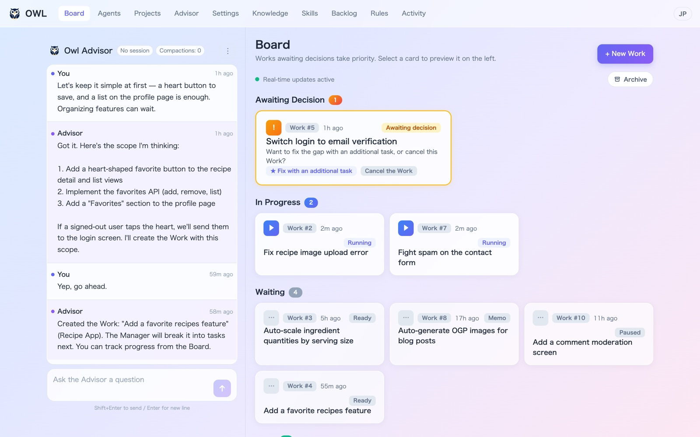
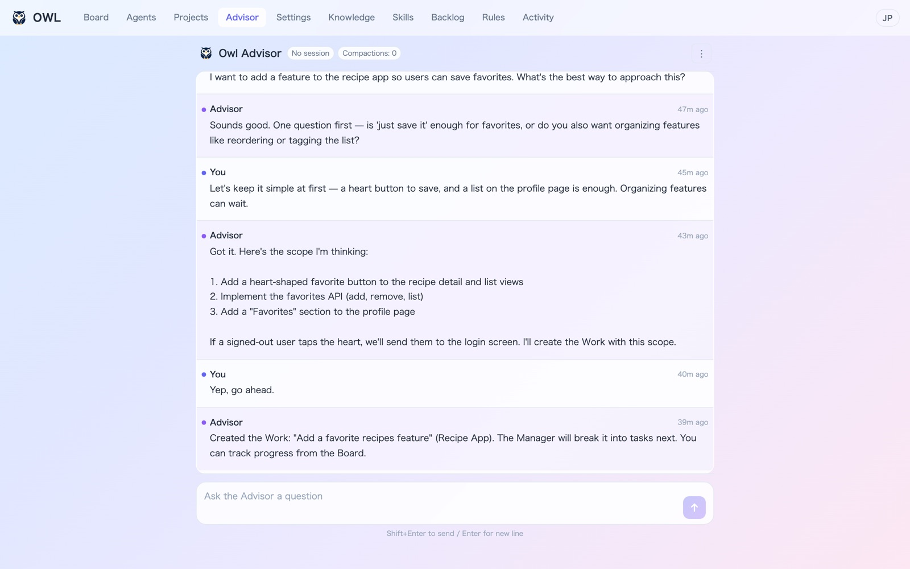
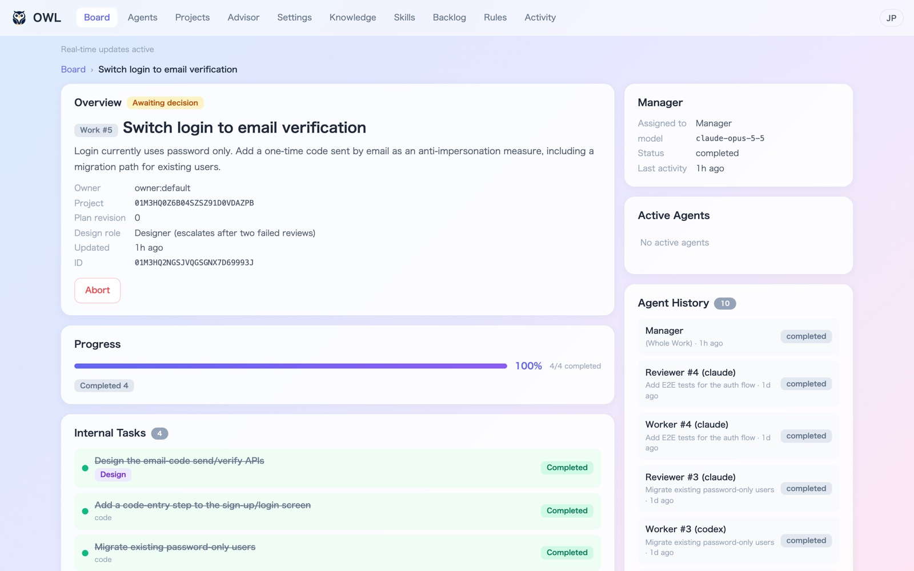
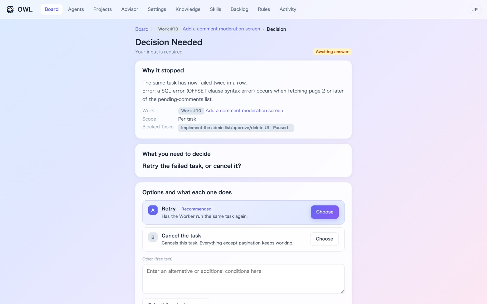
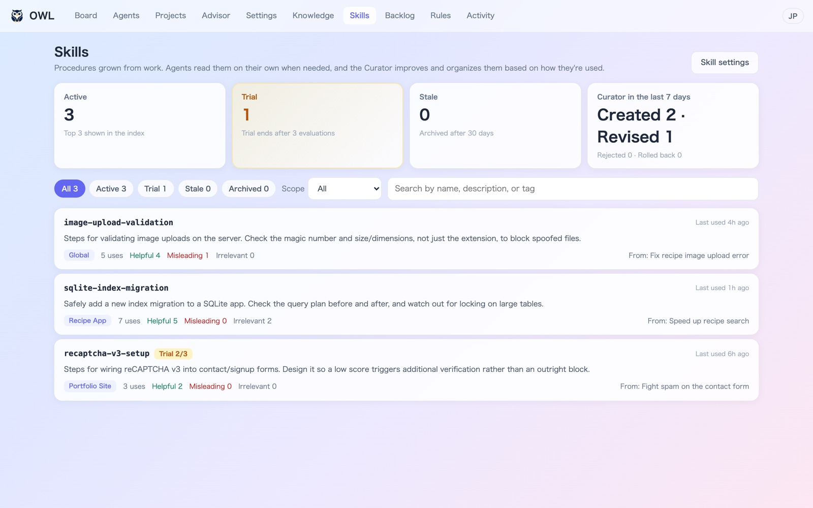
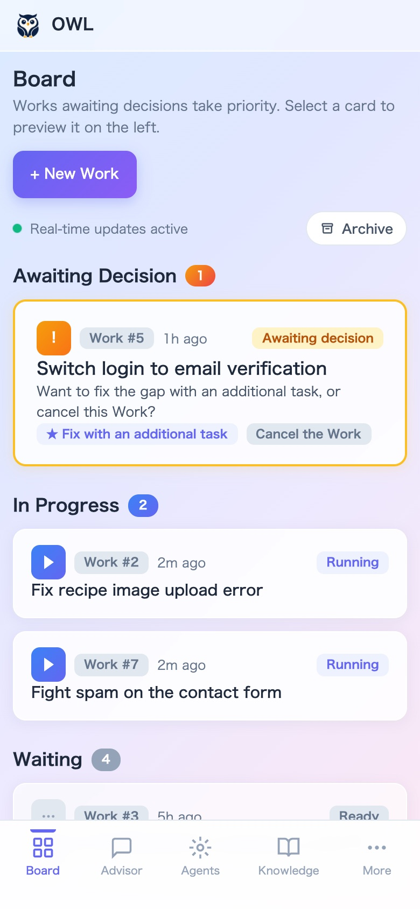

<p align="center">
  
</p>

<h1 align="center">Owl-Agent</h1>

<p align="center">
  <b>Run AI agents as a team. You only make the calls.</b>
</p>

<p align="center">
  <a href="https://github.com/riry521/owl-agents/actions/workflows/ci.yml"></a>
  <a href="LICENSE"></a>
  
  
</p>

<p align="center">
  English | <a href="README.ja.md">日本語</a>
</p>



Owl-Agent is a local orchestration tool where AI agents with different roles work together as a team.

Tell the Advisor what you want. The Manager plans the work, Workers build it in parallel, a Reviewer checks the results, and the finished work is merged into your project.
You are only asked when a decision is needed, such as choosing a direction or handling a failure, and you can answer from your phone.

Agents run through the **Claude Code** or **Codex** CLI you already have installed.

## Features

- **Just talk to it.** Discuss an idea with the Advisor in chat, and it turns the plan into a Work. You can also [reach the Advisor from Slack or Discord](#talk-to-owl-from-slack-or-discord), get notified there, and answer decisions with a button.
- **A team of roles.** Separate agents plan, design, build, and review. Each Worker gets its own Git worktree, so tasks run in parallel without stepping on each other.
- **You only handle decisions.** You get a question only when a choice is needed or a check fails. Decisions always sit at the top of the board.
- **Use it from anywhere.** Install Tailscale and run `owl serve` once, and your phone opens Owl at your own `ts.net` URL. No port forwarding and no login, and only your own devices can reach it. See [Use it from your phone](#use-it-from-your-phone-or-another-computer-tailscale).
- **Picks up where it left off.** All state lives in SQLite. If a process crashes or a provider hits its rate limit, the work resumes automatically.
- **Gets better with use.** Procedures found during work become skills that the Curator keeps improving. Knowledge is stored as Obsidian-compatible Markdown, and project rules are added only after you approve them.
- **Local and safe by default.** Only your own machine can reach Owl unless you opt in. Agent commands go through a permission hook. The Outbound Guard in that hook is a lightweight check that only looks at the destinations of `WebFetch`, `curl` and `wget` (including ones run inside `sh -c`); it is not a wall against network traffic from programs such as `python` or `node`.

## How it works

Owl-Agent follows one idea: **the DB remembers, the Core advances, the AI thinks.**
Instead of asking an AI to remember everything in a long conversation, state lives in the database and a program (the Core) decides who does what next.
Each agent gets only the information it needs for its current task.


| Role | What it does |
|---|---|
| Advisor | Your counterpart. Shapes the plan and creates Works |
| Manager | Splits a Work into tasks, coordinates them, and makes the final call |
| Worker | Implements tasks. Several Workers run in parallel |
| Reviewer | Verifies each Worker's result |
| Designer / Lead Designer | Designs the work: architecture, data model, API, and implementation approach |
| Librarian / Curator | Organizes and improves knowledge and skills learned from work |

## Screenshots

<table>
  <tr>
    <td width="50%"><br><b>Advisor</b>: talk through an idea and it becomes a Work</td>
    <td width="50%"><br><b>Work detail</b>: task progress and review results</td>
  </tr>
  <tr>
    <td width="50%"><br><b>Decisions</b>: each option explains what happens if you pick it</td>
    <td width="50%"><br><b>Skills</b>: procedures grown from real work, improved by the Curator</td>
  </tr>
</table>

<p align="center">
  <br>
  Check progress and make decisions from your phone, wherever you are, over Tailscale
</p>

## Quick Start

```bash
# Prerequisites: macOS 14+ or Linux, Node.js ≥ 22.17.0 and < 23, pnpm 10.15.0
git clone https://github.com/riry521/owl-agents.git
cd owl-agents
./setup.sh

# Configure
# setup.sh creates .env from .env.example when it is absent; edit that file.
# If you are configuring before setup, use: cp .env.example .env && chmod 600 .env
# The example defaults to the offline stub provider.
# For a real run, set OWL_PROVIDER=real and select an installed CLI with
# OWL_PROVIDER_ADAPTER=claude-cli/v1 or codex-cli/v1.
# .env is loaded automatically; explicit process environment values win.

# Open a new terminal, then start Owl and open the Web UI
owl open

# Check health
owl status
owl doctor
```

`setup.sh` adds the repo's `bin/` directory to `PATH` in your shell startup file,
so the `owl` command works from any directory:

| Shell | File |
|---|---|
| zsh | `~/.zshrc` |
| bash | `~/.bash_profile` (macOS) or `~/.bashrc` (Linux) |
| fish | `~/.config/fish/config.fish` |
| other | `~/.profile` |

It adds one line ending in `# owl-agent` and skips this step when the line is
already there. Open a new terminal (or `source` that file) before using `owl`.
If you move the repo, run `./setup.sh` again. Until then, `./bin/owl` works
from the repo root.

Set `OWL_LANG=ja` or `OWL_LANG=en` for CLI and setup messages. If unset,
`LC_ALL`, then `LC_MESSAGES`, then `LANG` determines the language.

The complete dependency inventory, including workspace packages, native build
requirements, optional provider CLIs, and the lockfile policy, is in
[`docs/dependencies.md`](docs/dependencies.md).

## Git push protection and automatic push

Owl's pre-push guard checks outgoing commits for private words. Run these
commands from the Owl checkout. Here, `/path/to/owl` means the Owl checkout and
`/path/to/target-repo` means the repository to protect. Install the guard in the
Owl checkout with `sh scripts/git-hooks/install.sh`, or install it in another
repository with `sh scripts/git-hooks/install.sh /path/to/target-repo`.
`./setup.sh` installs the guard when `OWL_PRIVATE_WORDS_FILE` is set or
`data/private-words.txt` exists; an installation failure produces a warning and
does not stop setup. If the target repository already has a shared
`core.hooksPath` outside the repository, install into that configured hooks
directory with `sh scripts/git-hooks/install.sh --use-hooks-path /path/to/target-repo`.
The installer reads the target repository's effective `core.hooksPath` and
does not change that setting; it leaves other hooks such as `.git/hooks/pre-commit`
alone.

An existing `pre-push` with contents that exactly match the managed hook is
treated as already installed; if it is not executable, the installer enables it.
Any different existing hook is left unchanged;
to chain it with the guard, preserve its input for both commands:

```sh
input=$(mktemp) || exit 1
cat >"$input"
"/path/to/owl/scripts/git-hooks/pre-push" "$@" <"$input" || { rm -f "$input"; exit 1; }
# Read the original input from "$input" in the existing hook.
rm -f "$input"
```

Put the private word list at `data/private-words.txt` in the repository being
guarded, or in the Owl checkout to use one list across repositories. You can
also set `OWL_PRIVATE_WORDS_FILE` to a list at another location; for automatic
push, make it available in Owl's server process environment. The hook checks
the environment path first, then the target repository's `data/private-words.txt`,
then the Owl checkout's `data/private-words.txt`. The default `data/` location
is ignored by Git. Use UTF-8 text with one word or phrase per line; blank lines
and lines beginning with `#` are ignored. Matching uses literal substring
search and does not print the matched word. If no usable list is found, the hook
warns and allows the push without checking it.

```text
# Keep this local; do not commit it.
PRIVATE_WORD_EXAMPLE
```

Automatic push is an opt-in setting for each Project. In the Projects view,
edit a Project and enable **Push automatically when a Work completes**. Projects
start with this setting off. When enabled, Owl pushes the base branch to its
configured upstream (for example, `main` tracking `origin/main`) after a Work
is merged. The base branch needs an upstream, and Owl never force pushes. A
push failure leaves the Work completed and reports the reason.

## Creating Work

```bash
# Create a new Work item via API
curl -X POST http://localhost:3787/api/v1/works \
  -H "Content-Type: application/json" \
  -d '{"request_id":"01ARZ3NDEKTSV4RRFFQ69G5FAV","idempotency_key":"01ARZ3NDEKTSV4RRFFQ69G5FAW","expected_version":0,"payload":{"title":"Build a login page","summary":"Email/password auth","size":"small","project_id":null}}'

# Check status
curl http://localhost:3787/api/v1/works
```

The server decomposes the Work into Tasks, dispatches Workers, runs Reviews, and reports the final verdict — all automatically.

## Operating Works

Details are in [docs/operations.md](docs/operations.md).

### Creating and steering Works

- **Draft Works.** Tell the Advisor "draft" or "just register it" and it creates the Work as a memo without starting it. Start it later with the Start button on the Work detail page.
- **Lead Designer.** A Work created with `design_mode: "lead"` (default `auto`) plans a design Task first and adds the implementation Tasks after the design is done.
- **Backlog.** The `/backlog` page lists review follow-ups per Project. Link an item to a Work, issue a Work from it, or dismiss it.
- **Steering from the Advisor.** The Advisor can send an instruction to a Work (`send_work_instruction`), edit its title or summary (`update_work`), and pause, resume, cancel or delete it (`pause_work`, `resume_work`, `cancel_work`, `delete_work`).
- **Cancel vs. delete.** Cancel stops the agents, cleans up the Work's worktree and keeps the Work as cancelled. Delete removes the Work from the database and frees its number.

### Keeping it running

- **Rate limits.** When a provider answers with a rate limit (for example HTTP 429), Owl pauses that provider and resumes automatically after the reset time, or after a backoff of 15, 30 and 60 minutes when none is given.
- **Core background work.** While Core itself runs integration verification, tests, pre-merge re-verification, a wait for the Git lane or a base merge, the Work detail page shows what Core is doing and for how long.
- **Build after merge.** After a Work is merged, Owl runs the Project's post-merge command (the build). If a dependency file such as `package.json` or `pnpm-lock.yaml` changed, the install command runs first. If either fails, the Owner is notified. Both commands are per-Project settings.

### Memory and rules

- **owl-memory.** Agents read knowledge pages through the read-only `owl-memory` MCP server (`index`, `page`, `search`). A Librarian keeps the pages organized.
- **Rules in Git.** Rule files live in `rules/`, but Git tracks only the shipped defaults (`rules/system/defaults.yaml`, `safety.yaml`, `owl-defaults.yaml` and `rules/role/advisor-defaults.yaml`). Rules you add or approve stay local.

## Web UI

```bash
owl open
# Starts Owl if needed and opens http://127.0.0.1:3787/owl/ in your browser
```

Pages: Board (work overview), Archive, Work detail, Settings (model config and presets), Projects, Advisor (chat), Backlog, Decision, Activity, Agents, Knowledge, Rules (including rule approvals), Skills, Tokens.

## CLI Commands

```bash
owl start          # Start server (background)
owl open           # Open the Web UI in your browser (starts Owl if needed)
owl stop           # Stop Owl and its project-managed helper processes
owl restart        # Restart server
owl status         # Show server status
owl doctor         # Run health checks (--json, --strict)
owl cleanup        # Remove stale workspaces
owl serve          # Publish to your tailnet with Tailscale Serve
owl serve --off    # Stop publishing with Tailscale Serve
owl advisor        # Chat with the Advisor in the terminal (Ctrl+D to exit; the server must be running)

# Exposing Owl directly on the network without Tailscale requires a bearer token.
OWL_BIND=0.0.0.0 OWL_API_TOKEN='use-a-long-random-value' owl start
```

## Memory search embeddings

Embeddings are optional and off by default. The optional dependencies are
`@huggingface/transformers`, `sqlite-vec`, and `onnxruntime-node`. If a dependency
is absent or cannot load (including a broken native binary), memory search still
uses SQLite FTS5 trigram search and `LIKE`; `/api/v1/memory/health` reports a
warning with the steps to enable embeddings. When embeddings are enabled, models
are still never downloaded automatically.
If you installed with `--no-optional`, run `pnpm install` without that flag to
install the optional dependencies before enabling embeddings.

To opt in, set `memory_embeddings.enabled` to `true`. In
`<dataDir>/memory-embedder.json`, use:

```json
{ "enabled": true }
```

Or set `OWL_MEMORY_EMBEDDINGS_ENABLED=1` in the server's environment. Then pull
the default model and restart the server:

```bash
node scripts/memory-models.mjs pull Xenova/multilingual-e5-small
node scripts/memory-models.mjs list
```

Model files are not included in this repository. Users fetch them with
`node scripts/memory-models.mjs pull <org/name>`. See
[THIRD_PARTY_NOTICES.md](THIRD_PARTY_NOTICES.md) for dependency and model
licenses and sources.

`node scripts/memory-models.mjs enable` enables embeddings and prepares the
default model in one command. Run it with `OWL_DATA_DIR` set to the server's
data directory if that variable is not already set in the shell. Restart the
server after changing the setting or downloading a model. Check
`/api/v1/memory/health` for the embedder state and any warning.

For an offline machine, pull the model on a connected machine, then copy the
entire model directory into the offline machine's `<dataDir>/models` or
`~/.owl/models` directory:

```bash
# On the connected machine; --dir names the models directory to pull into.
node scripts/memory-models.mjs pull Xenova/multilingual-e5-small --dir /path/to/models
# Copy /path/to/models/Xenova/multilingual-e5-small to
# <dataDir>/models/Xenova/multilingual-e5-small on the offline machine.
```

The same copied directory can be placed under `~/.owl/models`, or another models
directory can be selected with `OWL_MEMORY_MODELS_DIR`. Enable embeddings on the
offline machine and restart its server. `list` shows the models found in a
models directory. The server does not need network access to run the local
embedder.

The table gives measured sizes for the files used by the quantized ONNX (`q8`)
embedder: model config, tokenizer files, and `onnx/model_quantized.onnx`. Disk
sizes are the output of `du -sh`. Peak memory is the exact maximum resident set
size reported by `/usr/bin/time -l` for one short inference in a temporary
`@huggingface/transformers` 4.3.0 install, with remote models disabled and the
embedder's ONNX options. Measurements were made on macOS 27.0, Apple M4 Pro
(arm64), with Node.js 22.22.2.

| Model | Disk (`du -sh`) | Inference max RSS |
|---|---:|---:|
| `Xenova/multilingual-e5-small` (default) | 129M | 746,536,960 bytes (~712 MiB) |
| `Xenova/multilingual-e5-base` | 282M | 1,237,352,448 bytes (~1.15 GiB) |
| `Xenova/multilingual-e5-large` | 552M | 1,965,228,032 bytes (~1.83 GiB) |

## Use it from your phone or another computer (Tailscale)

With [Tailscale](https://tailscale.com/), you can open Owl from your phone wherever you are.

1. Install Tailscale on the computer running Owl and on each device you want to use, and sign in with the same account.
2. With Owl running, run this once on the computer:

   ```bash
   owl serve
   ```

3. Open the printed `https://<machine>.<tailnet>.ts.net/owl/` URL in the device's browser.

Tailscale keeps this setting, so after that `owl start` is enough and the same URL keeps working.
To publish on every `owl start` regardless, set `OWL_TAILSCALE_SERVE=1` in `.env`.
Run `owl serve --off` to stop publishing.

Only devices in your own Tailscale network (tailnet) can open this URL, so no login or token is needed.
Owl rejects requests that arrive through Tailscale Funnel, which would reach the public internet.
If you share your tailnet with other people, they can use Owl too.

## Talk to Owl from Slack or Discord

Connect Slack or Discord and you can work with Owl from the chat app you already use.

- **Talk to the Advisor in a channel**, just like in the Web UI. Images and files you send are saved to the Advisor's shared folder, so "look at the screenshot I just sent" just works.
- **Get notified** when a task finishes, fails, or needs a decision.
- **Answer decisions with buttons** right in the notification.

Each connection uses a conversation channel (your messages and the Advisor's replies) and a notification channel. They can be the same channel. Direct messages and other channels are ignored.
Both are optional, and saving the settings connects right away without a restart.

### Slack

1. Open [api.slack.com/apps](https://api.slack.com/apps), choose **Create New App → From a manifest**, and paste [`docs/slack-manifest.yaml`](docs/slack-manifest.yaml). The Settings screen also has a button that copies it.
2. Install the app to your workspace and copy the **Bot Token** (`xoxb-...`).
3. Under **Basic Information → App-Level Tokens**, create a token with the `connections:write` scope and copy it (`xapp-...`).
4. Invite the bot to the channels you want to use (`/invite @owl-agent`), and copy each channel ID from the bottom of the channel details.
5. In Owl, open **Settings → Integrations → Slack**, enter the tokens and channel IDs, and save.

### Discord

1. Open the [Discord Developer Portal](https://discord.com/developers/applications), create an application, and copy the token from the **Bot** page. On the same page, turn on **Message Content Intent**.
2. Under **OAuth2 → URL Generator**, choose the `bot` scope and the **Send Messages**, **Read Message History**, and **Embed Links** permissions. Open the generated URL to add the bot to your server.
3. Turn on Developer Mode in Discord (**User Settings → Advanced**), then right-click each channel and choose **Copy Channel ID**.
4. In Owl, open **Settings → Integrations → Discord**, enter the token and channel IDs, and save.

You can also use `owl setup` or the variables in `.env` (see `.env.example`). Tokens are kept in `.env` with mode `600`.

## Running connectors as a separate process (advanced)

Owl starts configured connectors inside the server, so most setups need nothing here.
Existing `SLACK_CHANNEL_ID` / `DISCORD_CHANNEL_ID` settings continue to be used
for both the conversation and notification roles.
The standalone `apps/connectors` command is also available when Slack or
Discord should run as a separate process. It reuses the same full connector
implementation as the server-managed path, including the configured
notification channel, Advisor replies, and interactive Decision buttons. The
Owl server must be running and `OWL_API_BASE`/`OWL_WS_URL` should point to it.
For a single-provider process, `OWL_CONNECTOR_ACCOUNT_ID` remains supported;
the provider-specific `OWL_SLACK_CONNECTOR_ACCOUNT_ID` and
`OWL_DISCORD_CONNECTOR_ACCOUNT_ID` variables take precedence. `--all` requires
both provider-specific variables; a shared variable alone is rejected.

```bash
# Set env vars (see .env.example), then:
node apps/connectors/dist/cli.js --slack
node apps/connectors/dist/cli.js --discord

# For --all, use two provider-owned Connector Account IDs:
OWL_SLACK_CONNECTOR_ACCOUNT_ID=01... \
OWL_DISCORD_CONNECTOR_ACCOUNT_ID=01... \
node apps/connectors/dist/cli.js --all
```

`owl stop` also stops standalone connector or supervisor processes launched
from this checkout before stopping the server. Processes from another Owl
checkout are treated as a separate instance.

## External plugins

Owl can launch external plugins as child processes. Set `OWL_PLUGINS_FILE` to
the absolute path of a JSON file; when it is unset, no external plugins are
loaded.

### Configuration

The file has a top-level `plugins` array. For example, if `plugins.json` is
in the repository root, this entry starts the sample plugin:

```json
{
  "plugins": [
    {
      "name": "log-notify",
      "command": "node",
      "args": ["dist/index.js"],
      "cwd": "examples/plugins/log-notify",
      "enabled": true,
      "env": {}
    }
  ]
}
```

Unknown keys at the top level or in a plugin entry are errors. If validation
fails, none of the plugins in that file start. Each entry follows these rules:

- `name` must match `^[a-z0-9][a-z0-9-]{0,39}$` and be unique.
- `command` must be a non-empty string.
- `args` is an array of strings and defaults to `[]`.
- `cwd` must name an existing directory. It may be absolute or relative to
  the directory containing `OWL_PLUGINS_FILE`.
- `enabled` must be a boolean and defaults to `true`.
- Every `env` value must be a string. Keys must match
  `^[A-Z_][A-Z0-9_]*$`; keys beginning with `OWL_` are reserved and rejected.

If the configured file is missing or invalid, the server logs
`[owl-server] plugins: ...` and continues starting without those plugins.

### Child process environment

The plugin process receives only these environment variables:

- `PATH`, `HOME`, and `LANG`, copied from the server process when present.
- The values in that plugin's `env` object.
- Reserved values set by Owl: `OWL_API_BASE=http://127.0.0.1:<port>/api/v1`,
  `OWL_API_TOKEN` when configured, `OWL_PLUGIN_NAME` (the entry's name), and
  `OWL_PLUGIN_STATE_DIR=<dataDir>/plugins/<name>` (created before launch).

Other variables from the server's `process.env` are not inherited. Read
plugin-specific secrets in the plugin process from a `.env` file in its own
`cwd`.

### Lifecycle

The server starts plugins after it begins listening, immediately after
`connectorManager.startAll()`. Plugin stdout and stderr are forwarded to the
server log one line at a time with a `[plugin:<name>]` prefix.

After an unexpected exit, Owl retries after 1, 2, 4, 8, and 16 seconds, for at
most five restarts. Ten minutes of stable runtime resets the retry count. Once
the retry limit is reached, Owl logs an error and stops retrying. During server
shutdown, plugins are stopped alongside the connectors: Owl sends SIGTERM,
then sends SIGKILL if a plugin has not stopped within the default 5-second
timeout. Plugins are not restarted while the server is stopping.

### Using the plugin SDK

`runPluginFromEnv` creates a `PluginConfig` from the environment and starts
the plugin:

```ts
export async function runPluginFromEnv(factory: (config: PluginConfig) => OwlPlugin, env?: NodeJS.ProcessEnv): Promise<OwlPlugin>;
```

`OWL_API_BASE` is required and maps to `core_api_base`; if it is missing, the
helper reports a clear error and exits with code 1. `OWL_API_TOKEN` maps to
optional `api_token`, and `OWL_WS_URL` maps to optional `core_ws_url`.
`OWL_PLUGIN_NAME` supplies `plugin_name`. When `OWL_PLUGIN_STATE_DIR` is
set, the helper uses a `FileConnectorStateStore` at
`<OWL_PLUGIN_STATE_DIR>/state.json`. After `start()`, SIGTERM or SIGINT calls
`stop()` and exits with code 0.

```ts
import {
  BasePlugin,
  runPluginFromEnv,
  type OwlEvent,
  type PluginConfig,
} from '@owl/plugin-sdk';

class LogPlugin extends BasePlugin {
  readonly name: string;

  constructor(config: PluginConfig) {
    super(config);
    this.name = config.plugin_name;
  }

  async onEvent(event: OwlEvent): Promise<void> {
    console.log(JSON.stringify(event));
  }
}

void runPluginFromEnv((config) => new LogPlugin(config));
```

### Using the SDK from another repository

For a private plugin repository named `my-private-plugins` alongside
`owl-agents`, build the SDK in the Owl checkout first:

```sh
# In owl-agents
pnpm --filter @owl/plugin-sdk build
```

Then reference the local SDK package from the plugin repository's
`package.json` (the path is relative to that package):

```json
{
  "dependencies": {
    "@owl/plugin-sdk": "file:../owl-agents/packages/plugin-sdk"
  }
}
```

Install the dependency in that repository with `npm install` before building
the plugin.

### Building and starting the log-notify sample

The sample is outside the pnpm workspace, so the root `pnpm install` and
`pnpm build` do not install or build it. From the `owl-agents` repository
root, build the SDK and then install and build the sample in its own directory:

```sh
pnpm --filter @owl/plugin-sdk build
cd examples/plugins/log-notify
npm install
npm run build
```

Register the generated `dist/index.js` with `command: "node"`,
`args: ["dist/index.js"]`, and `cwd: "examples/plugins/log-notify"` when
the configuration file is in the repository root. Set `OWL_PLUGINS_FILE` to
the absolute path of that file and start Owl; the server launches the plugin,
which writes each received event as a single JSON line to stdout.

## Supervisor (optional)

Process monitor that restarts the server on crash.

```bash
node apps/supervisor/dist/supervisor.js
```

## Workspace Layout

| Path | Package | Purpose |
|------|---------|---------|
| `packages/shared` | `@owl/shared` | Shared types & contracts |
| `packages/db` | `@owl/db` | SQLite database layer |
| `packages/core` | `@owl/core` | Workflow engine & state management |
| `packages/agent-runtime` | `@owl/agent-runtime` | AI role prompt builders & response parsers |
| `packages/providers` | `@owl/providers` | Provider adapters (stub, claude-cli, codex-cli) |
| `packages/connector-slack` | `@owl/connector-slack` | Slack connector |
| `packages/connector-discord` | `@owl/connector-discord` | Discord connector |
| `packages/plugin-sdk` | `@owl/plugin-sdk` | SDK for external plugins |
| `apps/server` | `@owl/server` | HTTP/WS server & CLI |
| `apps/web` | `web` | Next.js dashboard |
| `apps/supervisor` | `@owl-agent/supervisor` | Process monitor |
| `apps/connectors` | `@owl-agent/connectors` | Slack & Discord bridges |

## Provider Modes

- **stub**: Hardcoded responses for development/testing (no AI calls and no provider CLI)
- **real**: Spawns the selected `claude` or `codex` CLI subprocess for actual AI execution

Set `OWL_PROVIDER=stub` for deterministic offline use. For real mode, configure the
selected `OWL_PROVIDER_ADAPTER`, model, and executable. Owl checks only the selected
adapter at startup; provider CLIs are external dependencies and are never installed
automatically. Existing per-role Claude/Codex settings remain supported when both
executables are available.

## Supported systems and data

macOS 14+ and Linux are supported for v1. Windows is unsupported/experimental: no
Windows-specific process, native dependency, or service integration is claimed here.

`OWL_DATA_DIR` is the common durable data root for SQLite, logs, PID/state files,
uploads, connector metadata, and settings. The default is `./data` under
`OWL_ROOT`. Connector Tokens are kept in the project `.env` with mode `600`,
alongside custom Provider API keys. Older `.owl-data` files are copied only when
the canonical file is missing; the legacy directory is never deleted or
overwritten. Existing encrypted connector Vaults are accepted for one-time
migration when `OWL_SECRET_PASSPHRASE` is explicitly supplied, but normal
startup never prompts for it.

Back up the complete `OWL_DATA_DIR` while Owl is stopped (including `owl.sqlite`,
settings, and uploads) and the project `.env` if connector access must be
restored. Do not copy secrets or `.env` into source control.

Known v1 limitation: the Typesafe API key settings UI returns a masked value and
stores the key in the mode-0600 settings file. Connector Tokens and custom
Provider API keys are kept in mode-0600 `.env`; restrict access to the project
directory and use a dedicated account.

## License

[MIT](LICENSE)
